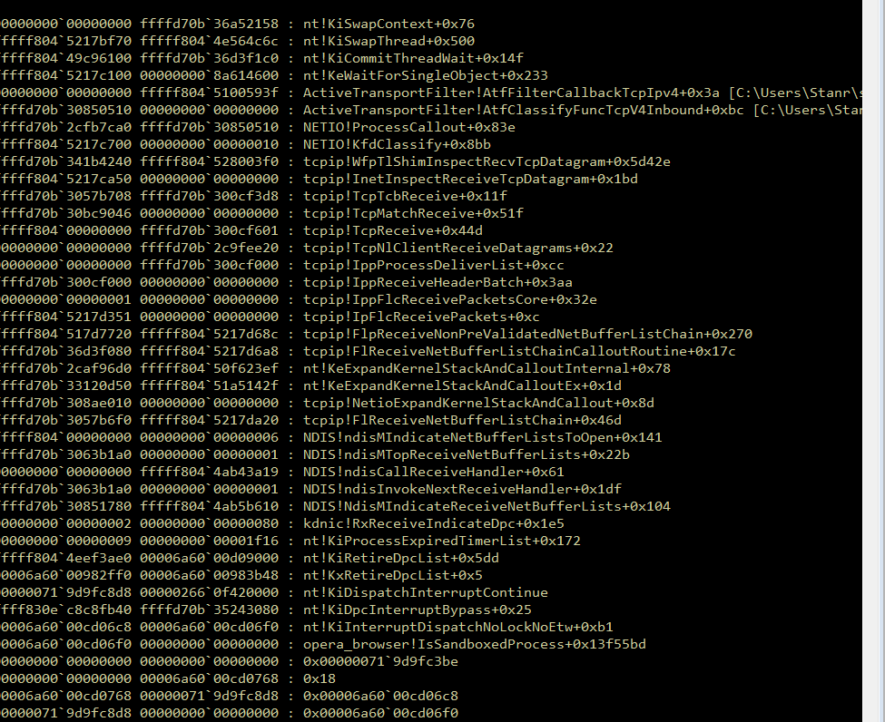
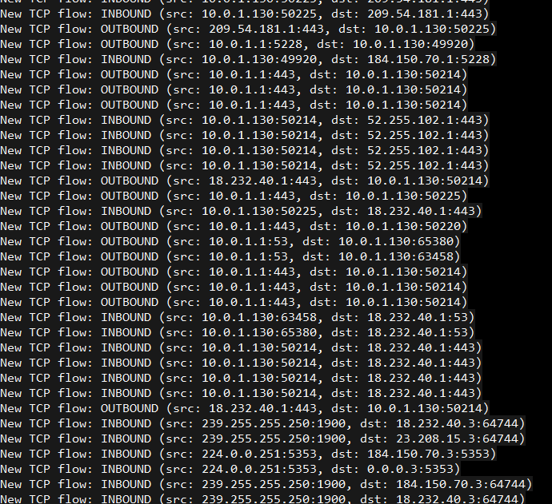

# ActiveTransportFilter

### _This project is currently under development_

## Table of Contents (TOC)

- [ActiveTransportFilter](#activetransportfilter)
    + [_This project is currently under development_](#-this-project-is-currently-under-development-)
  * [Table of Contents (TOC)](#table-of-contents--toc-)
  * [Summary](#summary)
  * [Features and Requirements](#features-and-requirements)
  * [Directory summary](#directory-summary)
  * [`src` Directory](#-src--directory)
  * [ActiveTransportFilter Project UML diagram](#activetransportfilter-project-uml-diagram)
  * [ActiveTransportFilter (ATF) project summary](#activetransportfilter--atf--project-summary)
    + [`DeviceConfigService`](#-deviceconfigservice-)
    + [`ActiveTransportFilter`](#-activetransportfilter-)
    + [`DriverController`](#-drivercontroller-)
    + [The IPv4 filtering algorithm](#the-ipv4-filtering-algorithm)
  * [`filter.c` Comment on Internal ATF Functionalities](#-filterc--comment-on-internal-atf-functionalities)
  * [TODO List](#todo-list)
  * [Interesting Fixes and Discoveries During Development](#interesting-fixes-and-discoveries-during-development)
    + [Implement correct IRQL](#implement-correct-irql)
    + [BSOD in flow after starting Opera](#bsod-in-flow-after-starting-opera)
    + [Issue with `vcpkg` and libcurl](#issue-with--vcpkg--and-libcurl)
    + [Example of Callout Handlers Working](#example-of-callout-handlers-working)

<small><i><a href='http://ecotrust-canada.github.io/markdown-toc/'>Table of contents generated with markdown-toc</a></i></small>


## Summary

This is a project that I have started for educational purposes, please feel free to use it how you wish.

`ActiveTransportFilter` is a device driver that makes use of the Windows Filtering Platform (WFP) for operating-system level **IP blacklisting**, **Domain level blacklisting**, and **packet inspection**. I have decided to first implement the **IP blacklisting** component, as this is simpler and will allow me to build the architecture necessary for implementing a more complex filter driver.

## Features and Requirements
* Uses `vcpkg` manifest, so `vcpkg` is required, along with VS2022
* Compiled with Windows SDK 10.0.22621.2428
* Driver is compiled with WinDDK 10.0.22621.2428
* User-mode code is compiled with C++20
* Statically linked libraries (for compatibility)

## Directory summary
* `.git` -> git directory
* `/bin` -> output binary directory. The installer will be `/bin/DriverController.exe` (which contains all other components in the resource)
* `/build` -> temporary build directory for objects and such
* `/config` -> runtime configurations
* `/docs` -> contains images and resources for `README.md`
* `/src` -> Main source directory

## `src` Directory

| Filename                  | Description                                                                                                                                                                                                                                                                                                                                                        |
|---------------------------|--------------------------------------------------------------------------------------------------------------------------------------------------------------------------------------------------------------------------------------------------------------------------------------------------------------------------------------------------------------------|
| ActiveTransportFilter/    | Driver project                                                                                                                                                                                                                                                                                                                                                     |
| common/                   | The 'common' directory, containing inline headers and shared headers between user mode and kernel mode                                                                                                                                                                                                                                                             |
| DeviceConfigService/      | Main Config service, configures and controls ActiveTransportFilter                                                                                                                                                                                                                                                                                                 |
| DriverController/         | Project that generates the unified installer                                                                                                                                                                                                                                                                                                                       |
| InterfaceConsole/         | A placeholder project for a usermode console that interfaces with DeviceConfigService                                                                                                                                                                                                                                                                              |
| ActiveTransportFilter.sln | ActiveTransportFilter solutions file                                                                                                                                                                                                                                                                                                                               |
| vcpkg.json                | Contains external dependencies (vcpkg)                                                                                                                                                                                                                                                                                                                             |
| vcpkg-configuration.json  | vcpkg config file 

## ActiveTransportFilter Project UML diagram
_TODO_

## ActiveTransportFilter (ATF) project summary

The driver will consist of three major components: the user-mode service (`DeviceConfigService`), the device driver (`ActiveTransportFilter`), and lastly the installer (`DriverController`).

### `DeviceConfigService`

The user-mode service will be used to configure the driver, to control the WFP callout layers, and to populate the IPv4 and IPv6 blocklists.

* Uses `IOCTL` to control the driver, the commands are defined in `ioctl_codes.h`, and the implementation on the driver side is in `ioctl.c`.
* The service will read an ini file, stored in `config/filter_config.ini`
* The service will read the ini file for a list of IP blocklists
* The service will provide a DNSBL list to the driver as well
* The service controls the driver and WFP callouts:

1) `DriverCommand.InitializeDriverComms()` is first called, which will attempt to communicate with the driver through a symbolic link (driver creates this on `DriverEntry()`)
2) `FilterConfig` is created, which parses the ini. Later, the ini will contain the domains of IP blocklists, where the blacklisted IPs will be obtained
3) `DriverCommand.CmdSendIniConfiguration()` is called, which send the "basic" configuration, i.e. the ini file, to the driver. At this point the driver is waiting for instructions
4) `DriverCommand.CmdPopulateIpv4List()` is called (to be implemented), which will send blacklisted IPs to the driver in chunks, being appended by the driver
5) `DriverCommand.CmdStartWfp()` is called which will instruct the driver to initialize WFP, register callouts and filters, and, lastly, begin intercepting traffic as it comes from NDIS/WFP
6) To update the config, the driver needs to disable filtering. This is done through `DriverCommand.CmdStopWfp()`. Then update or append the config and call `DriverCommand.CmdStartWfp()` again to start filtering

### `ActiveTransportFilter`

The device driver component that will use Windows Driver Framework (WDF) and Windows Filtering Platform (WFP) to intercept inbound/outbound TCP traffic.

* The driver must be signaled and configured by the service before it can begin operations
* The WFP callout layers are configurable, the default ones are:

```
ADD_WFP_LAYER(data->enableLayerIpv4TcpInbound, &FWPM_LAYER_INBOUND_TRANSPORT_V4);
ADD_WFP_LAYER(data->enableLayerIpv4TcpOutbound, &FWPM_LAYER_OUTBOUND_TRANSPORT_V4);
ADD_WFP_LAYER(data->enableLayerIpv6TcpInbound, &FWPM_LAYER_INBOUND_TRANSPORT_V6);
ADD_WFP_LAYER(data->enableLayerIpv6TcpOutbound, &FWPM_LAYER_OUTBOUND_TRANSPORT_V6);
ADD_WFP_LAYER(data->enableLayerIcmpv4, &FWPM_CONDITION_ORIGINAL_ICMP_TYPE);
```

* `ioctl.c` handles the IOCTL communication from the usermode service
* `wfp.c` initializes WFP
* `config.c` produces a `CONFIG_CTX` context structure, which will be used to shape traffic
* `filter.c` will use the `CONFIG_CTX` structure to perform filtering, all WFP callouts are sent over to `filter.c`

### `DriverController`

The `DriverController` is used to install the driver, service, and other components. Using VisualStudio, I have compiled all the necessary binaries and objects into the `DriverController.exe` file, which will unpack the files and create the necessary services.

The components are packed into `DriverController`'s resource segment, and automatically updated when doing a full rebuild in VisualStudio.

### The IPv4 filtering algorithm

This is still under design. I will most likely use a type of radix "trie" to create a tree which will have 255 children for each octet in the IP. I will experiment with various methods until I find one that is most suitable.

* Experimentation with a "patricia trie", an O(m) search (for each ipv4 octet) 
* Each array contains a pointer to another array and so on for 4 octets. 
* The size of a trie is twice as large on x64 than x86 due to the pointer size.
* Drawback is that in a 64-bit environment, pointers are large and so the larger the pointers the larger the trie. The tree would be more memory-friendly in on a system with 32-bit pointers.

This implementation of the "patricia trie" is my own variant. I don't use a struct, with an array of pointers to the next struct. Rather, each node (octet) is represented by an array of 255 pointers, which are indexed using the octet. The pointer at the octet/index, then points to the next node, which consists of an array of 255 pointers and so on. 

So each octet is a node which is an array of 255 void pointers (I know it's a mouthful, but the idea here is to reduce total memory size by using pointers rather than structs -- so the entire trie is just a bunch of pointers pointing to more pointers! Pointers, pointers everywhere...)

See `ipv4_trie.c`. Here is the insert algorithm:

```
ATF_ERROR AtfIpv4TrieInsertPool(IPV4_TRIE_CTX *ctx, const struct in_addr *pool, size_t numOfIps)
{
    // Iterate through the input pool, inserting each IP into the trie
    for (size_t currIp = 0; currIp < numOfIps; currIp++) {
        struct in_addr ip;
        ip.S_un.S_addr = pool[currIp].S_un.S_addr;

        VOID **currTrieNode = ctx->root; // Represents the current trie node, starting from the first octet in the IP

        // Iterate through each octet of the current IP, and insert trie at the corresponding index (octet)        
        for (UINT8 octetCount = 0; octetCount < sizeof(struct in_addr); octetCount++) {
            const UINT8 currOctet = (ip.S_un.S_addr >> (octetCount * 8)) & 0xff; // Use the counter to grab the octet we need

            // If we've reached the last octet, add a -1 (ipEndMarker)
            if (octetCount == 3) {
                currTrieNode[currOctet] = -1; // Indicates that this is the last node in the trie (the last octet)
                break;
            }

            // If the pointer at that index is NULL, we need to allocate another trie which is `sizeof(VOID *) * MAX_UINT8` (255)
            if (currTrieNode[currOctet] == 0) {
                currTrieNode[currOctet] = (UINT8 *)ATF_MALLOC(IPV4_TRIE_NODE_SIZE);
                // Handle no memory condition
            }

            // Iterate into the next trie
            currTrieNode = currTrieNode[currOctet];
        }
    }

    ctx->totalNumOfIps += numOfIps;

    return ATF_ERROR_OK;
}
```

## `filter.c` Comment on Internal ATF Functionalities

I have added a comment to the top of `filter.c`, which gives an outline on how some of the components of ATF work. I have decided to copy/paste that comment here for readability and instruction.

```
//
// Filename: filter.c
//  Description: The filtering engine for ATF. filter.c requires a valid configuration configuration before any
//   packet processing. 
// 
// [Design]
//   The idea behind ATF is to use WFP (Windows Filtering Platform) to intercept network packets on the local system, 
//   and to match the packets against an IP and DNS blacklist (ruleset). The ruleset allows us to drop packets based 
//   on conditions specified in the config ini. A primary requirement for this device driver is *speed at any cost*. 
// 
//   This means that ATF cannot hang WFP or the TCP/IP stack by slowly processing packets. It needs to be very optimized so that
//   control can be relinquised quickly back to the OS.
// 
//   The ATF driver is a firewall, essentially, allowing each packet to be inspected and matched against the user-defined ruleset.
// 
//   The ATF driver uses WFP to register callouts that allow the filter engine (filter.c) to listen on a particular network layer.
//   The filter engine (filter.c) will intercept all packets on that layer (which is also configurable on the ini), run the packet
//   against a configurable ruleset, perform an action against the packet, and release the packet back to NDIS.
// 
//   A network layer, for example, is FWPM_LAYER_INBOUND_TRANSPORT_V4, which is the inbound TCP IPv4 layer, or the
//   FWPM_LAYER_DATAGRAM_DATA_V6 layer, which is UDP v6. ATF supports configuration of layers in the usermode config ini file.
// 
//   config/filter_config.ini contains the user-definable ruleset for filtering traffic, configuring WFP listen layers, adding
//   blacklists, and other switches for controlling the firewall. 
// 
//   **Oversimplified diagram showing how a packet is intercepted by ATF**
//   **See README.md for a detailed trace!**
// 
// 
//      [[[Operating System]]]                                          [[[ATF Filter Driver]]]
// 
//      [Usermode socket open/connect/send API is called] -> 
//      [user-mode libraries/APIs called] -> 
//      [NT kernel called] ->
//      [NDIS invoked / tcp/ip stack reached] ->
//      [WFP reached] -> 
//      [Match against a layer (TCP/IPv4)] ----------------------->     [WFP calls on wfp.c/filter.c] ->
//                                                                      [WFP calls TCP/IPv4 layer callout] ->
//                                                                      [wfp.c handler reached] ->
//                                                                      [filter.c handler reached] ->
//                                                                      [Main filtering routine called] -> <---[Config supplies ruleset]
//                                                                      [Packet inspeced; Ruleset checked] ->
//                                                                      [Apply "action", PASS, BLOCK, Alert]
//      [WFP Callout Ended] <--------------------------------------     [Return to WFP, exit callout]
//      [NDIS / tcpip stack completes the user's API request]
//      [Usermode socket open/connect/send gets response]
// 
// 
//   Note: This shows the API pseudo-trace from a simple send()/recv() on the user land, through the kernel, to NDIS and WFP, then to the 
//          ATF driver callback function. 
// 
//          filter.c intercepts all network traffic, including connects, DNS requests, or whichever layer was configured, and can 
//          manipulate the traffic according to the ruleset. The intercept happens because the driver requests a callout to be 
//          registered (see wfp.c) with WFP. 
//  
// 
//          The filter.c engine will check against the ruleset, as supplied by the config, and will
//          modify the packet if necessary (for example, block the packet, or just alert on it).
// 
//          Then, ATF will release control back to WFP by returning from the callout handler.
//          Once control is released back to WFP, the operating system will handle the rest.
// 
//          However! If the ATF decides to block a packet, then the user-mode API, like send()/recv() - for packet transfer - 
//          may fail or return an error code.         
//   
// 
//   When the driver is first started, WFP is not initialized. Only DriverEntry() is called and the driver invokes the standard
//   WDF functions for setting up a device, symbolic links (s.t. the service can send commands to the driver), IOCTL handlers
//   to be able to receive commands from the service, and other infrastructure-related operations on the driver. 
// 
//   The usermode service, which will run in the background, will send commands to the driver (like the ini and ruleset) so that
//   a configuration can be applied to filter.c. (see below for more info on the service and driver commands)
//
//   The driver will wait for a signal from the usermode service before anything further is done. Usually, the driver and service 
//   will start. The service will parse the ini, create a ruleset, and send it to the driver. Lastly the service will instruct
//   the driver to register callouts and start the filtering subsystem.
// 
//   filter.c intercepts WFP layers as specified in the config, the primary NDIS/WFP hook being AtfFilterCallbackTcpIpv4().
// 
//   The filter callback is non-synchronized. Once a packet is received, filter.c will parse the packet and access the ruleset. 
//   From there, a rule will be applied on the packet: PASS, BLOCK, or ALERT. The ini can set the default state on how to 
//   handle traffic.
// 
//   The config also contains the following ways to block IPs (I will add DNS later, and when I have time):
// 
//      1) Manually add IPv4 and IPv6 addresses that we want to block
//      2) Add a URL to an online blacklist source, like spamhaus, which provides the service with dynamic blacklist IPs
//      3) Specify a default action (PASS, BLOCK, or ALERT) on an IP or DNS entry
// 
//   Note: a callback function, that handles a packet transport event, is called a "callout" in WFP lingo. A callout needs to be 
//   registered, that part is done in wfp.c. From there, filter.c is called to perform the actual filtering work.
// 
// [IOCTL & Commands]
//   Another major component to the ATF device driver is communication to the service. 
//   The user-mode service will communicate with the driver using Input/Output Control (IOCTL). 
// 
//   TODO**** sruzin: do a validation check from where the IOCTL comes from
// 
//   The device driver and filter engine (filter.c) are entirely controlled by the usermode service. The service must send commands to the driver
//   via IOCTL (see ioctl_codes.h for available commands, or driver_command.h for the command abstraction object in C++), which will
//   then configure the driver and filtering engine.
// 
//   As stated above, the driver does nothing until instructed by the usermode service. Look at ioctl_codes.h for details.
// 
//   The supported commands are indicated below (this is an arbitrary list, not the intended order, for ordering of commands, see below)
// 
//      1. Keep alive (not implemented, yet)
//      2. Start WFP service (IOCTL_ATF_WFP_SERVICE_START)
//      3. Send default ruleset config (IOCTL_ATF_SEND_WFP_CONFIG)
//      4. Append an IPv4 blacklist from an online blacklist service (IOCTL_ATF_APPEND_IPV4_BLACKLIST)
//      5. Flush the config (IOCTL_ATF_FLUSH_CONFIG)
//      6. Stop the WFP service (IOCTL_ATF_WFP_SERVICE_STOP)
// 
// 
// [Rulesets]
//   The driver's filtering engine, filter.c, will require a configuration (mostly a serialized version of the ini file) to operate.  
// 
//   filter.c operates by intercepting traffic, i.e., when a packet is created or received by NDIS, a callback in filter.c will
//   be invoked. From there, a ruleset will be applied to the packet (from the config), and an "action" will be made in regards to
//   what to do with the packet.
// 
//   A major component of the filtering engine is to store a large amount of blacklisted IPs, DNS names, etc, and match the packet's
//   source/dest IPs to the blacklist. If the IP exists, an "action" should be taken. Either "PASS", "BLOCK", or "ALERT", all of 
//   which can be defined in the ini.
// 
// [Patricia Trie]
//   This section goes in detail on how filter.c applies the ruleset. Specifically, how IPv4 addresses contained in the packet are matched
//   against a blacklist of hudreds of thousands of IPs.
//
//   The "naive" method for checking IPs in a blacklist is to linearly iterate from one IP to the next in the blacklist array.
//   which is O(n) at worst, and will severely hangup the firewall. 
//   This can be especially destructive if the OS has a large amount of packets going inbound/outbound, or a lot
//   of sockets being created.
// 
//   Now, A "patricia trie" is used to store all blacklisted IPs. This is a sort of binary tree with many branches (rather than 2).
// 
//   It helps me to understand this by looking at complexity:
//   The patricia trie has a high space complexity (see below section), the more IPs in the blacklist, the more memory required for the trie.
//   However, the trie has a very fast time complexity, at O(m), where m is the number of octets in an IP. 
//   The trie depth is therefore 4, so the time complexity is O(m) where m = 4.
//   Meaning, to check if an IP exists in the trie, all we have to do is iterate through the IP octets and check for nodes in the trie!
// 
//   So when filter.c receives a packet, it reads the source/dest IPs, and matches it against the blacklist. If the 
//   IP exists in the trie, it's blacklisted.   
// 
//   Let's say the IP we're checking for in the trie is 10.0.2.1.
// 
//   Trie description:
//   Each node in the trie consists of an array of 255 pointers, starting from the root node. 
//   The pointer at root_node[10] may be NULL or non-NULL. Note that the 10 is the first octet of the IP.
//   A NULL at root_node[10] means that no IPs that start with 10.x.x.x exist in the trie, so no need to go further in matching octets. 
// 
//   Now, if the pointer at root_node[10] != NULL, it means that the first octet, 10, does exist in the trie. 
//   The next step is to iterate to the second octet, 0, and move our current_node to be equal to root_node[10], and
//   check if current_node[0] != NULL. 
// 
//   The pattern begins to form. We are essentially iterating through each octet in the IP, and using the octet as an index to the 
//   pointer array, we can determine if the IP exists in the trie. Once we get to the last octet, and the last octet is a non-NULL value,
//   (I set it to -1, since we don't need any more memory wasted), we know that the IP 10.0.2.1 exists in the blacklist/trie.
//   
//   Here's a visual summary:
// 
//   Target IP: 10.0.2.1. Let's say that the target IP exists in the trie already.
// 
//   To match against the blacklist, we need to iterate through each octet in the IP, in big-endian. (Hence O(m) complexity)
//   The trie / blacklist consists of a root node, which is an array of 255 pointers.
//   
// ** In fact, all Nodes in the trie are arrays of 255 pointers, 
// **  therefore `const size_t nodeSize = sizeof(VOID *) * MAX_UINT8` per node.
// 
// Start with the first octet, 10. Get the root node for the trie. Does a pointer at index 10 exist in that node?
//   
// (root node)
//   [0] -> NULL (base address of the node)
//   [1] -> NULL
//   [2] -> NULL
//   ...
//   [10] -> VALID pointer!
//   [...]
//   [255] -> NULL
// 
//      Yes, it exists.
//      Now, set your current node to that pointer at the node's index, and move to the next octet in the IP, 0:
// 
// Since we're matching against another octet, the second octet, we have a new node to look at:
// 
// (root_node[10] node)
//   [0] -> VALID pointer!
//   [1] -> VALID pointer! (points to the base address of the next octet's node)
//   [2] -> NULL
//   [...]
//   [255] -> VALID pointer!
// 
//      We can see that at our index, 0, there is a non-NULL pointer, meaning we can further iterate through the IPs.
//      Notice that there are other valid pointers, meaning that an IP like 10.1.2.1, or 10.255.2.1, may also be in the blacklist.
// 
//      Continue iterating through each octet, if we get to the last octet, 1, 
//      we just need to make sure that the pointer at that index is non-NULL.
// 
// 
//      So you can see the chain of nodes, each pointed to by the last using the IP's octet as the index. 
//      If there are valid Pointers all the way to the last octet, then the IP exists in the trie. If any octet along the path 
//      yeilds a NULL pointer, we know that the IP is not in the trie, since there exists no node for that octet.
// 
//   This has substantial memory overhead, especially on 64-bit systems with 64-bit pointer sizes, but the
//   complexity is O(m), where m is the number of octets in IPv4, meaning, negligable in terms of speed complexity.
//   So the filter.c engine will be very fast when matching IPs against blacklists!
// 
//   I decided to go with this design choice (i.e. use heavy non-paged pool memory for the trie, but gain very fast returns
//   from filter.c to WFP) as to not hold up WFP or any packets -- algorithm speed is of utmost importance, so let's assume we 
//   have the physical memory for it!
// 
//   I tried an experiment earlier where WFP was held up by filter.c, to do a linear O(n) blacklist match, 
//   and the entire OS was hung up (especially when starting the browser and many simultaneous packets are generated and sent
//   to filter.c. So the idea behind the trie is to check the ruleset ASAP and release the packet back to NDIS immediately.
// 
// [Trie Space Complexity for Trie]
// 
//   The trie requires a great deal of memory to store IPs, but this number will gradually decrease as more and more IPs are being added
//   to the trie, some of which share the same octets/nodes.
// 
//   Let's do some math:
// 
//   1) On a 64-bit system, we have 8 bytes per pointer. 
//   2) Each node requires 255 pointers, meaning 255 * sizeof(VOID *);
//   3) Total space per each node: 2040bytes!
// 
//   For one IP address, we need four nodes:
//   4) 2040 * 4 = 8160bytes per IP!
// 
//   Lastly, let's say that 100000 blacklisted addresses exist in the trie, at *worst*. This means that none of the addresses share any 
//    common prefix and so a new node is needed for each IP.
// 
//   This will obviously not be the case in a real world distribution, but let's just assume that:
// 
//   5) 8160b * 100000 = 816,000,000
//   6) 816,000,000bytes = 816.0MB. 
// 
//   So to store 100K IPs with unreasonable distribution, we require about 816.0MB of space! This space is in non-paged memory as well,
//   which is another draw back to the trie method. 
// 
//   That said, we can limit the amount of non-paged memory used by the trie by limiting the IPs used. Keep in mind that the trie will
//   also non-duplicate IPs, so if an online blacklist repeats the same IP a few times, the IP will not be re-added to the trie!
// 
//   All that in mind, physical memory vs computation time, I think it's better to sactifice memory for speed, especially when dealing
//   with NDIS and the windows TCP/IP stack -- it's important to return from the callout as fast as possible.
// 
//   Another note: Since filter.c requires access-only (and will shut down WFP if a change is to be made in the trie), there is no need
//   for atomic or synchronization primitives, further decreasing processing overhead. This is to be noted since WFP can call the callout
//   in filter.c from various threads and contexts. The trie, so long as it's not modified, is thread-safe.
// 
//   Dev note: I tried to do modify the trie in real-time, with WFP running, by implementing spinlocks and mutexes to protect the trie state, 
//   but this inevitably led to BSODs, specifically in the WaitForSingleObject() routine on the KMUTEX. More details on that on the README.md file.
// 
// Note: Adding or altering the trie requires WFP to be shutdown and callbacks unregistered from WFP.
//  The trie can be appended to by invoking IOCTL_ATF_APPEND_IPV4_BLACKLIST while WFP is shutdown. The new IP pool will simply
//  be added to the existing trie.
// 
// IOCTL: filter.c is configured using the following process:
// 
// Note: At this point, the driver's entrypoint (DriverEntry()) is called, devices and  sym links configured, and IOCTL handlers registered. 
//  Further, the service has configured itself and is running in the background. However, WFP is *NOT* registered and not initialized,
//  only the core device driver functionality is operating, allowing it to receive commands from the service.
// 
// Note: All IOCTLs are locked with a KMUTEX. Only one IOCTL command may operate at a given time. 
// 
// **Initial Filter/WFP Startup**
//  (Verify that WFP is stopped and callouts are unregistered)
// 
// [Basic Config Initialization]
//  1. Usermode service parses the ini file, containing the basic config
//      a. First, the ini file is read from the disk
//      b. inireader.h is used to parse the ini into a FilterConfig object, which contains all the necessary configurations
//      c. The FilterConfig object then serializes the ini data into a USER_DRIVER_FILTER_TRANSPORT_DATA (user_driver_transport.h)
//          struct, which will be the payload for IOCTL
// 
// [ATF Filter Engine Initialization]
// Note: at this stage, only configs are exchanged between the driver and service, WFP and filtering will not be running
//          until the command to start WFP is issued by the service
//  2. The service then calls IOCTL_ATF_SEND_WFP_CONFIG, via IOCTL, along with the serialized config structure as a parameter
//      a. The driver receives the IOCTL identifier, which is handled by ioctl.c, and ioctl.c will do some basic sanity checks here
//      b. ioctl.c calls config.c and passes the serialized config
//      c. config.c then further parses the serialized config and creates a config struct, known as the "config context", 
//          the primary context (CONFIG_CTX, in config.h), used by ATF (especially filter.c and wfp.c) as a ruleset to 
//          filter and manipulate traffic. The entirety of the filter ruleset is contained in this instance of CONFIG_CTX
//      d. config.c then invokes a function in filter.c that associates that config context (CONFIG_CTX) with the filter engine
//      e. config.c returns to ioctl.c with a success, assuming filter.c and config.c parsed the config successfully
//      f. ioctl.c returns back to usermode with a status success
// 
// [Append IPv4 Blacklist Config]
// (this is done if the blacklist URLs are specified in the ini)
//  2. Usermode queries online IP blacklists, parses the IP addresses into a large DWORD array     
//      a. First, the ini is parsed into a vector of URLs
//      b. Curl is called on each URL, which returns a massive text file containing blacklisted IPs
//      c. The data returned from curl is parsed and stored into a chunk of memory consisting of an array of DWORDS, for each IP
//      d. Serialize the buffer
//     
//  3. Usermode calls IOCTL_ATF_APPEND_IPV4_BLACKLIST, which sends the blacklisted IPs to the driver
//      a. ioctl.c intercepts the request and passes it to config.c
//      b. config.c at this point begins reading the IP address buffer as sent by ioctl.c
//      c. If a "patricia trie" needs to be created, this is the time. Otherwise, if IPs are supplied in the default config,
//          a trie will already exist
//      d. ipv4_trie.c is called to populate the current trie context (which is stored in the config context)
//      e. config.c sends the finished config to filter.c
// 
// [WFP and Filter Engine Startup]
//  4. The Usermode service starts the driver service (IOCTL_ATF_WFP_SERVICE_START)
//      a. ioctl.c intercepts the request and calls wfp.c to begin initialization
//      b. wfp.c verifies that a config exists
//      c. wfp.c queries filter.c for the current config context
//      d. wfp.c uses the config context to determine which WFP layers to intercept. (for example TCPv4/inbound, or UDP outbound)
//      e. wfp.c will initialize WFP engine first, then register all callouts and filters for WFP, and further, 
//          register the callout callback to the function pointer observed in wfp.c:descList constant structure
//          Note: the wfp.c callback acts as a "funnel" into filter.c, but, ultimately, WFP will invoke wfp.c, not filter.c
//      f. wfp.c calls WFP to commit the changes
//      d. wfp.c instructs filter.c that the subsystem has been initialized and the engine is running
//      d. wfp.c returns a success to ioctl.c
//      e. ioctl.c returns a success to the service
//  5. The usermode service receives an ATF_ERROR_OK if everything above succeeded. 
// 
// [Appending or Modifying the Ruleset/config]
// Further: To add IPs to the blacklist or modify the config context, the WFP subsystem needs to be halted, here is the process
//  1. The service calls IOCTL_ATF_WFP_SERVICE_STOP to stop the WFP service
//      a. ioctl.c callback is invoked, which instructs wfp.c to unregister ATF from the WFP subsystem
//      b. wfp.c calls on DestroyWfp(), which destroys the callout layers, filters, etc, and detaches from WFP
//      c. filter.c at this point is just waiting, the config still exists, but nothing is received from WFP
//      d. wfp.c returns to ioctl.c a status success
//      e. ioctl.c returns the success status (or error status) to the usermode service
// 
//  2. Usermode service receives a signal that the driver has stopped processing traffic
//  3. The service can do IOCTL_ATF_FLUSH_CONFIG, which will instruct the driver to completely flush the config context, or:
//     simply have the service re-parse the ini, and send a IOCTL_ATF_SEND_WFP_CONFIG to the driver
//      a. If the IOCTL_ATF_FLUSH_CONFIG is received, then ioctl.c will call filter.c and instruct the filter to destroy its context
//          and stop the engine. Another IOCTL_ATF_SEND_WFP_CONFIG must be sent afterwards. This is useful in clearing out old rules.
//      b. If IOCTL_ATF_SEND_WFP_CONFIG is received, then ioctl.c will call retrieve the config context from filter.c
//      c. The config context will then, along with the IOCTL buffer, be sent to config.c for parsing and appending or removal of items
//      d. config.c will then invoke filter.c to commit the current config
//      e. filter.c flags that the filtering service is ready, and returns to ioctl.c
//      f. ioctl.c returns a status succcess to usermode
// 
//  4. The service can also call IOCTL_ATF_APPEND_IPV4_BLACKLIST to append more blacklists into the trie, or use 
//      the flush command to flush the trie entirely (IOCTL_ATF_FLUSH_CONFIG)
// 
// [Start WFP and Filter Engine Again]
//  5. usermode receives the status success and starts the WFP subsystem, via IOCTL: IOCTL_ATF_WFP_SERVICE_START
//      (see above for details on startup)
//      a. driver performs startup, and returns the OK signal through ioctl
// 
//  6. The usermode service receives successful WFP initialization
// 
// [While ATF is Running]
// 
//      Currently, tracing is implemented in trace.h, which logs ALERTs or DEBUG messages via DbgPrintEx(). This outputs the filter.c
//      operations directly into the OS log, which can be seen using DbgView.exe (sysinternals).
// 
//      Additionally, a logging mechanism is in place for usermode (user_logging.h), which is an inline class that instructs the service
//      to print its debug and status messages into the same debug source (accessed via DbgView.exe).
// 
//      The driver will continue to run until a WFP stop command is received by the service. Otherwise, nothing else is required to 
//      maintain the filter/firewall.
//
//
```


## TODO List

1) Fix static linkage with libcurl and vcpkg. Issue is that statically linking CRT and libcurl fails. Currently, I am manually pushing the debug and release bins for libcurl

## Interesting Fixes and Discoveries During Development

### Implement correct IRQL
Note that the function for initializing WFP is `FwpmEngineOpen()`, for this function to work, the kthread must be in `PASSIVE_LEVEL`. An issue I encountered was that I attempted to add a spinlock to synchronize IOCTLs. This raised the IRQL to `APC_LEVEL`, and `FwpmEngineOpen()` would fail.

This was resolved by using a less intensive lock, like `KMUTEX`, which operates at `PASSIVE_LEVEL`.

### BSOD in flow after starting Opera

Symptoms: BSOD when opera browser is opened, and hundreds of new connections come in. Crash is in ATF in `KMUTEX` lock



Issue is probably that WFP doesn't like locking in the callout functions, which I used to sync up with the filter.c engine. I need to remove the `KMUTEX` entirely, and freeup the callout immediately.

As a result, I cannot "dynamically" change the config for the filter engine, I need to stop WFP entirely, refresh the config, and restart WFP.

**Update** removing the `KMUTEX` in the callout was the fix.

### Issue with `vcpkg` and libcurl

This is mostly a note for myself, but the issue is that I require libcurl.lib to be statically linked to the service, rather than dynamic linkage. Using the `vcpkg` manifest, I managed to get the dynamic linking working, along with the vcpkg that compiles libcurl (and inih, but this is a header-only file so no lib required), but it does not work with static linking.

I'm looking into fixes. Potential fix is to remake the solution using CMake, and instruct the compiler to force static linkage, but this is not ideal.

### Example of Callout Handlers Working

Below is Windbg in a remote kernel debugging instance (using hyper-v). Each packet is intercepted by the ATF driver and sent to the debugger using `trace.c`.

